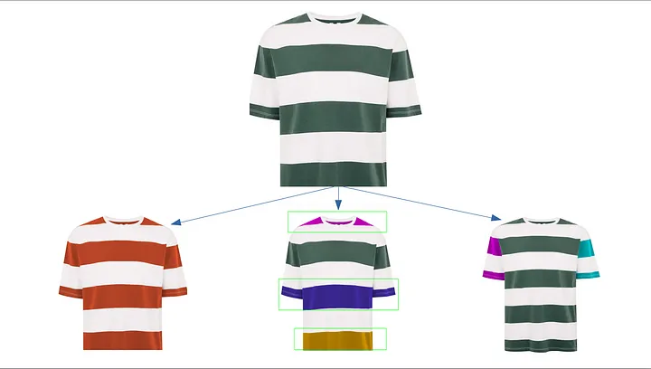

While scrolling through the Fashion section on a shopping website, have you ever thought — “I wish I could change this color, and then the dress would look amazing!!”

I feel this all the time….!!! :P

Working in the Image Processing field gives you the power to make this possible. As we started working on it, we came across this concept of **Color Segmentation**. The idea was to customize/change the colors present in an image. As we researched, we came across many amazing articles on color segmentation using Neural Networks & OpenCV (a Python library written for dealing with Computer Vision challenges).

There were many cool projects like:

- *Invisibility Cloak* (like the one from Harry Potter)
- *Color Detection*
- *Virtual Pen*

Segmentation using Neural Networks might have given us better accuracy, but there were other roadblocks like training/processing time and lack of training data. So, we worked with OpenCV as its accuracy can further be improved and is faster when compared with segmentation using Neural Networks.

Here I have explained a few approaches that we tried while working on this project.

<iframe 
width="560" 
height="315" 
src="https://www.youtube.com/embed/qAyAKZenf9E" 
title="YouTube video player" 
frameborder="0" 
allow="accelerometer; autoplay; clipboard-write; encrypted-media; gyroscope; picture-in-picture" 
allowfullscreen>
</iframe>

---

## Pick the portion containing a certain color

Have you ever wondered, how does a computer see an image?

It processes the image as a combination of RGB (Red, Green, and Blue) values varying between 0 to 255. Here, when all three values are 0, we see Black color, and when all three values are 255, we see White color.

While dealing with real-life pictures, we have to deal with shadows and color gradients, which cause varying RGB values.

Our initial approach was to traverse through the image and set some thresholds to identify a different color.

**Cons:**  
Thresholds had to be set manually for each color in each image. As we want the process to be as autonomous as possible, we rejected this idea.

---

## HSV Color Picker

HSV (Hue, Saturation & Value) is a cylindrical color model that remaps the RGB primary colors into dimensions that are easier for humans to understand. With the help of this color space, we can identify and mask portions containing a color.

**Pros:**  
- Good accuracy  
- Speed  

**Cons:**  
HSV values for masking required precision, which only comes with manual work. And hence, we dropped the idea.

---

## KNN Algorithm

KNN (K Nearest Neighbors), as the name suggests, traverses through all the RGB values and plots them on a coordinate plane. You can read more about KNN elsewhere.

**Pros:**  
- Categorizes colors efficiently.  
- The only manual input is the number of clusters (or colors in our case).  

**Cons:**  
- The processing time for each image is high (about 4 seconds for a 1200x1200 image).  

Here is how it differentiated between colors, which can be further used to make masks. So, our ultimate choice was KNN. KNN comes with the OpenCV module.

---

## Applying a different color on that portion

One might assume that this part of the project is easy. Now, as the mask is ready, all we have to do is change the RGB value of the entire masked portion. It is a suitable solution when dealing with images containing solid colors. But as you can see in our case, we have high RGB variations.

Painting a new color (changing RGB value directly) would cause a loss of texture and light information. So, we must come up with an alternative way to color the image while keeping the textures intact.

---

## Gray-scale Coloring

What are textures?  
**Texture** is defined as the physical composition of something or the look and feel of fabric. An example of texture is the smooth feeling of satin. When light reacts with cloth material, it gives rise to textures.

This means that we only have to store light intensity, which can be done with gray-scale images.

As you can see in gray-scale images, all textures are stored here. Now we can stack the same image thrice and color them R, G, and B (in certain proportions). Then stack them to form a complete image.

Here we faced another problem: The intensity of the applied color on the final image doesn’t match the actual color provided. This happens because of dark areas in gray-scale images. To change this intensity mismatch, we can increase light intensity on textures selectively by adding a certain value (called a gray-scale threshold). This keeps textures intact while maintaining actual color intensity.

---

## Increasing Customization

Customization in this project can be increased if portions with similar colors are colored differently.

Initially, we made an ROI (Region of Interest) selector. As shown in examples below, users can select specific areas and work with them independently.

---

## Limitations

While increasing customization, two types of problems arose:

1. **Parts easily distinguishable (e.g., sleeves or collars):**  
   - These could be solved easily using an ROI selector.
   - Users simply select portions and modify colors inside them.
   - Example: Customizing sports T-shirts.

2. **Parts not distinguishable (e.g., similar-colored areas):**  
   - These required manual input.
   - Masks had to be created using coordinates to distinguish parts with similar colors.
   - Once precise masks were provided around such areas, KNN could handle segmentation effectively.
   - Results depended heavily on mask precision — more precise masks yielded better results.

---

## Conclusion

In this article, we explored common challenges faced during product color customization and their solutions. The goal was to achieve fast results with presentable accuracy.

This field remains under Research & Development; future advancements may automate processes further while improving accuracy and precision.
