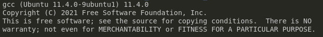
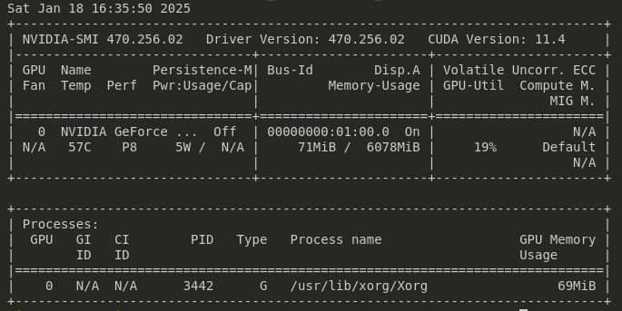
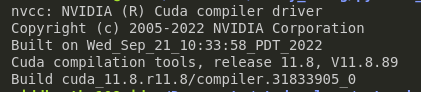
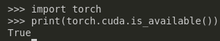
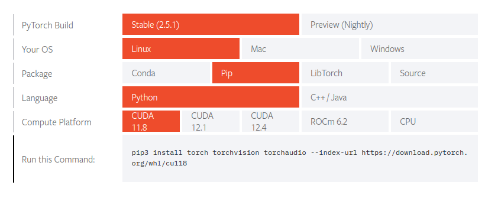
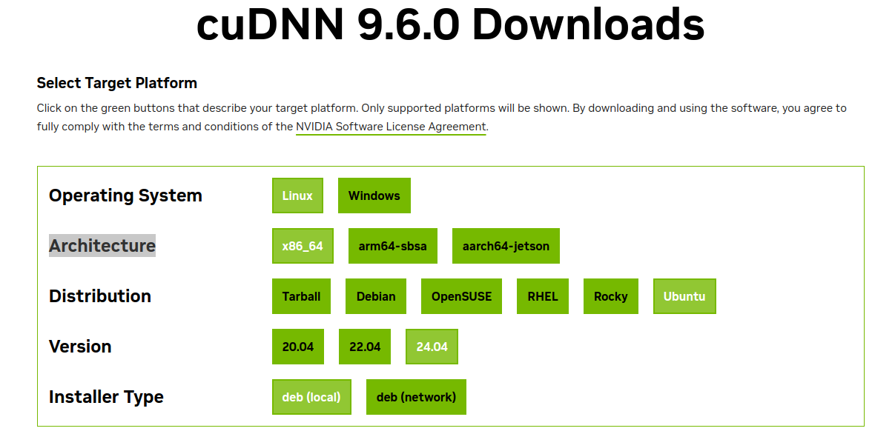

This tutorial provides a step-by-step guide to install Cuda and PyTorch on an Ubuntu system. It covers the installation process for both Python and C++ setups, ensuring compatibility with your hardware and software configurations.

## System Specifications
The following setup is tailored for systems with:
- Processor: Intel i7 8th Generation
- GPU: Nvidia GTX 1060 6GB
- Memory: 16 GB RAM
- Storage: 512 GB SSD

## Software Versions Installed
- GCC Version: 11
- NVIDIA Driver: 470
- Python Version: 3.10.16
- CUDA Toolkit Version: 12.0.76
- PyTorch (Python and C++)


## Installation Steps
### 1. Install GCC  
To ensure compatibility with CUDA, install GCC version 11.
```bash
wget https://ftp.gnu.org/gnu/gcc/gcc-11.3.0/gcc-11.3.0.tar.gz
tar -xvf gcc-11.3.0.tar.gz
cd gcc-11.3.0
```
Use the following commands to configure GCC 11 as an alternative (this installs both choices in update-alternatives and allows you to choose either of them based on the compatible versioning):
```bash 
sudo update-alternatives --install /usr/bin/gcc gcc /usr/bin/gcc-12 12
sudo update-alternatives --install /usr/bin/gcc gcc /path/to/gcc-11 11
sudo update-alternatives --config gcc
```

Verify the installation
```bash 
gcc --version
```
Output:

Ensure it shows gcc (Ubuntu 11.x).


### 2. Install NVIDIA GPU Driver

First, remove any existing NVIDIA drivers: 
```bash
sudo apt remove --purge '^nvidia-.*'
sudo apt autoremove
sudo apt clean
```

Update the package list and install Compatible NVIDIA Driver XXX (As per my hardware, the most stable version that I can use is 470)
```bash
sudo apt update
sudo apt install nvidia-driver-470
sudo reboot
```
Check installation:
```bash
nvidia-smi
```

Output:


### 3. Install CUDA Toolkit
Download and  isntall the CUDA Toolkit:
```bash
wget https://developer.download.nvidia.com/compute/cuda/11.8.0/local_installers/cuda_11.8.0_520.61.05_linux.run
chmod +x cuda_11.8.0_520.61.05_linux.run
sudo sh cuda_11.8.0_520.61.05_linux.run --silent --toolkit
```

Add CUDA paths to your environment:
```bash
echo 'export PATH=/usr/local/cuda-11.8/bin:$PATH' >> ~/.bashrc
echo 'export LD_LIBRARY_PATH=/usr/local/cuda-11.8/lib64:$LD_LIBRARY_PATH' >> ~/.bashrc
source ~/.bashrc
```

Verify the CUDA installation
```bash
nvcc --version
```

Output:



### 4. [OPTIONAL] Compatible Python version installation
If not present let's add python repositor:
```bash
sudo add-apt-repository ppa:deadsnakes/ppa
sudo apt install python3.10 python3.10-venv python3.10-dev
```

You can configure alternatives for Python versions if needed.

### 5. Install PYTORCH with CUDA support using PIP
```bash
pip install torch torchvision torchaudio --index-url https://download.pytorch.org/whl/cu118
```

Test the installation in python
```python
import torch 
print(torch.cuda.is_available())
```
Output: 


### 6. Install PYTORCH for C++

Install necessary tools like CMake:
```bash
sudo apt install cmake -y
```

Follow the official Pytorch C++ setup guide [here](https://pytorch.org/get-started/locally/)


### 7. Install cuDNN

Download the appropriate cuDNN package from [NVIDIA's website](https://developer.nvidia.com/cudnn-downloads?target_os=Linux&target_arch=x86_64&Distribution=Ubuntu&target_version=24.04&target_type=deb_local) (e.g., version 9.6):
```bash
wget https://developer.download.nvidia.com/compute/cudnn/9.6.0/local_installers/cudnn-local-repo-ubuntu2404-9.6.0_1.0-1_amd64.deb
sudo dpkg -i cudnn-local-repo-ubuntu2404-9.6.0_1.0-1_amd64.deb
sudo cp /var/cudnn-local-repo-ubuntu2404-9.6.0/cudnn-*-keyring.gpg /usr/share/keyrings/
sudo apt-get update
sudo apt-get -y install cudnn-cuda-11
```

Link cuDNN libraries to CUDA paths:
```bash
sudo ln -sf /usr/lib/x86_64-linux-gnu/libcudnn* /usr/local/cuda/lib64/
```