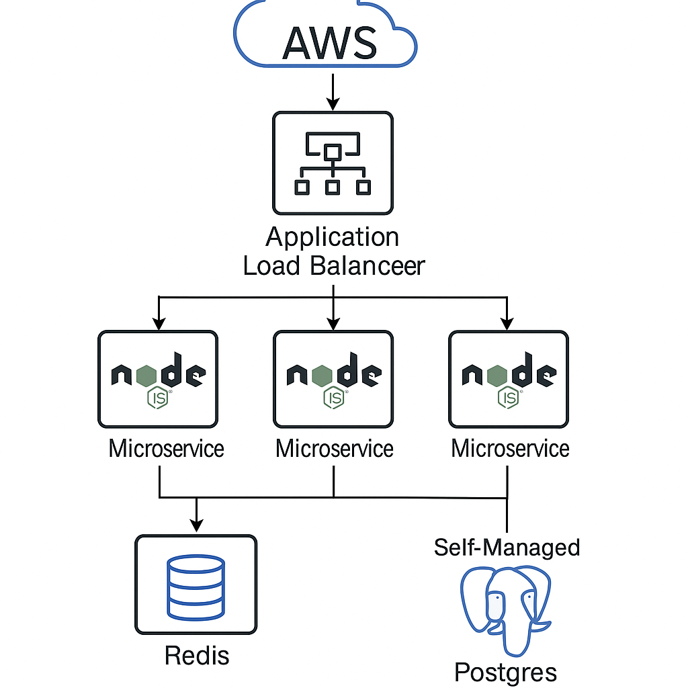
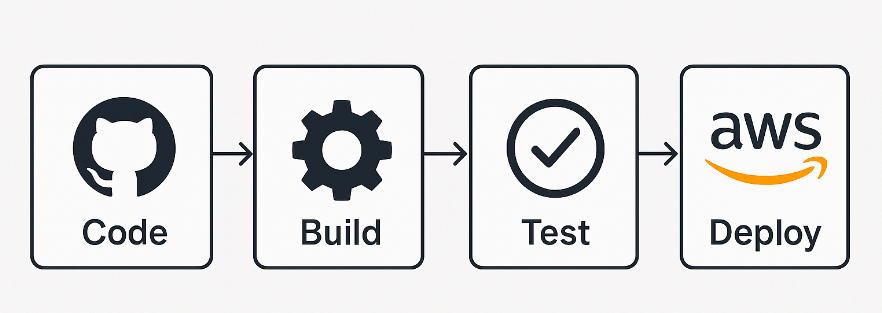

## **Introduction**

Did you know that creating a private, scalable social network for a specific community can be trickier than building a platform for the general public? When you’re dealing with preexisting membership IDs, custom requirements, and performance constraints, the process demands careful planning and execution.

In this blog post, **we’ll explore how our team** tackled these challenges while building a **closed-community social platform** for the community. You’ll learn about our **technical architecture**, **infrastructure decisions**, **problem-solving** methods, and **future plans**—all in a way that’s understandable if you have some background in web or mobile development.

By the end, you’ll have insight into:

- Managing **multiple user profiles** in a single application
- Implementing **location-based search** and caching strategies
- Performing **load testing** to simulate real user interactions
- Handling **push notifications** with Firebase
- Scaling architecture on a **budget** without compromising performance

Whether you’re a budding developer or a seasoned architect, we hope this real-world scenario helps illuminate some best practices—and pitfalls to watch out for!

---

## **Table of Contents**

1. [Project Context & Architecture Overview](#project-context--architecture-overview)
2. [Key Problems and How We Solved Them](#key-problems-and-how-we-solved-them)
   - [1. Multiple Profiles with a Legacy MID](#1-multiple-profiles-with-a-legacy-mid)
   - [2. MID Verification Overhead](#2-mid-verification-overhead)
   - [3. Multi-Factor Search Optimization](#3-multi-factor-search-optimization)
   - [4. Admin Control & Platform Monitoring](#4-admin-control--platform-monitoring)
   - [5. Load Testing & Predicting User Engagement](#5-load-testing--predicting-user-engagement)
   - [6. Push Notifications](#6-push-notifications)
3. [Infrastructure & Tools](#infrastructure--tools)
4. [Future Scope & Technical Improvements](#future-scope--technical-improvements)
5. [Key Takeaways & Conclusion](#key-takeaways--conclusion)

---

## **Project Context & Architecture Overview**

To meet the unique demands of a **closed community**, we needed to incorporate their **legacy member ID (MID) system**, support **multiple user profiles** under one account, and ensure **budget-friendly** scalability for up to **10,000+ users**. Our architecture centers around:

- **Node.js Microservices** for Authentication, Search, and Post/Job creation.
- **Amazon Web Services (AWS)** with t3.medium EC2 instances and an **Application Load Balancer** to distribute traffic.
- A **self-managed PostgreSQL** database, augmented by **Redis caching** for frequently queried data.
- **NGINX** layered on each EC2 instance to fully utilize the multi-core environment for Node.js.

Below is a simplified **diagram** of our architecture (placeholder, with alt text for accessibility):

>  > _A high-level diagram illustrating the AWS load balancer distributing traffic to three Node.js microservices, connected to a self-managed Postgres instance with Redis caching._

---

## **Key Challenges and How We Solved Them**

### **1. Multiple Profiles with a Legacy MID**

**The Challenge**  
The client required a single account to manage several profiles—one personal and one or more business profiles. Meanwhile, each user came preassigned with a **Member ID (MID)** from a legacy system.

**Our Solution**

- **Separate User Auth DB**: We stored global user credentials in a dedicated table.
- **Profiles DB**: Each user could link multiple profiles (one-to-many relationship).
  - This ensures the ability to scale or add new profile types (e.g., additional business or organization profiles).
- **MID Retention**: MID was tied to each user record to reflect their preexisting membership.

**Benefit**

- Simplifies login flow: Users only log in once, then seamlessly switch among profiles.

**Trade-Off**

- Added complexity in the database schema, requiring careful synchronization to avoid data integrity issues.

---

### **2. MID Verification Overhead**

**The Challenge**  
Legacy code used for verifying MIDs wasn’t designed to handle high traffic. Continual verification on every login could overwhelm that server.

**Our Solution**

- **One-Time MID Verification**: Performed during **signup** only.
- **Cached Results**: Once verified, we store user credentials in our new system, eliminating repeated lookups.

**Benefit**

- Relieves strain on the legacy server and ensures a faster login experience.

**Trade-Off**

- Limited real-time checks. If the legacy system changes a user’s status, we might miss it unless we manually re-verify.

---

### **3. Multi-Factor Search Optimization**

**The Challenge**  
Users needed robust **location-based** (distance) search combined with tags, names, and other attributes. These calculations had to remain performant, even at scale.

**Our Solution**

- **Google Geocoding**: Convert addresses to lat/long and save them in Postgres.
- **Custom Postgres Queries**: Use text-based indexes for tags/names, plus order by distance (lat/long) in the same query.
- **Caching**: Redis caches frequently searched patterns or profiles.

**Benefit**

- Responsive user experience for searching businesses by distance and relevant services.

**Trade-Off**

- Reliance on external geocoding introduces extra cost or rate-limit constraints.

---

### **4. Admin Control & Platform Monitoring**

**The Challenge**  
The client needed real-time control over user activities and a comprehensive way to track platform performance.

**Our Solution**

- **Admin Dashboard**: Allows admins to:
  - Verify or block users
  - Manage posting permissions
  - Track KPIs (user engagement, connections, job posts, etc.)

**Benefit**

- Centralized user and content management, preventing spam or abuse.

**Trade-Off**

- Additional development overhead to create and maintain an admin panel.

---

### **5. Load Testing & Predicting User Engagement**

**The Challenge**  
As a brand-new platform for a private group, user engagement patterns were unpredictable. We needed to test for **10k+ potential users**.

**Our Solution**

- **Modular Stress Testing**: We tested each core API (authentication, posts, likes, etc.) individually under load.
- **Custom Python Scripts**: Simulated **5,000 concurrent users**, performing randomized actions such as posting, liking, and searching.
- **Rate Limiting**: Capped each IP at **100 calls/minute** to protect services.

**Benefit**

- Identified weak spots early, prompting us to split out the Authentication service for better performance.

**Trade-Off**

- Manual scaling decisions to keep costs down. If usage dramatically spikes, we may need quick intervention.

---

### **6. Push Notifications**

**The Challenge**  
We wanted a **unified** push notification solution that worked well across Android and iOS, without platform-specific limits.

**Our Solution**

- **Firebase Cloud Messaging (FCM)**: Offers cross-platform support.
- **Session-Based Token**: FCM tokens are tied to user sessions. When sessions expire, tokens get removed.

**Benefit**

- Seamless notification management that scales for both major mobile platforms.

**Trade-Off**

- Requires some setup for secure token storage and daily maintenance to clear expired tokens.

---

## **Infrastructure & Tools**

1. **AWS EC2**

   - **t3.medium** instances balance cost and performance. Typically, we run three instances behind an ALB.
   - Auto scaling is configured to add more instances when CPU usage exceeds a threshold, though we often scale manually to remain budget-friendly.

2. **Self-Managed PostgreSQL**

   - Also hosted on a t3.medium instance, with no special Postgres extensions.
   - **Prisma** for schema definitions and migrations, plus **Redis** for caching.

3. **NGINX & Node.js**

   - **NGINX** ensures multiple worker processes can handle concurrent connections efficiently.
   - **Express.js** and **Passport.js** handle routes, authentication, and session management.

4. **Version Control & CI/CD**
   - **GitHub Actions** for automated testing.
   - Deployment triggered manually via shell scripts, followed by **rolling updates** to minimize downtime.

>  > _An illustrative flowchart of how code is built, tested, and deployed to AWS t3.medium instances._

---

## **Future Scope & Technical Improvements**

1. **Eject from Expo**

   - Currently, we use **React Native (Expo)**, but frequent SDK updates can slow down development at scale.
   - Ejecting grants full control over native modules and can reduce version conflicts.

2. **Evaluate ORM Options**
   - **Prisma** works wonders for straightforward CRUD but advanced queries might benefit from Sequelize or raw SQL.
   - If the database is split (micro-database approach), using multiple ORMs specialized for each use case could offer performance gains.

---

## **Key Takeaways & Conclusion**

Building a **closed-community** social platform introduces hurdles like **legacy ID verification**, **multi-profile management**, and **location-driven search**. Our team tackled these challenges with a **well-thought-out AWS infrastructure**, **Node.js microservices**, **self-managed PostgreSQL**, and **deliberate caching strategies**. We also approached uncertain user engagement with **modular load testing**, culminating in robust rate limiting and an admin panel for real-time oversight.

Here’s what you can do next:

- **Experiment** with microservices if you’re dealing with domain-specific modules like Auth, Search, and Posts.
- **Incorporate load testing early** to detect and fix bottlenecks before going live.
- **Balance** cost and performance by combining auto scaling with manual oversight—particularly if you have a tight budget.
- **Plan for expansions** to your tooling (e.g., Expo, ORM) to maintain flexibility and performance over time.

> **Open-Ended Question**: If you were building a niche social platform for your own community, which part of this architecture would you modify first to fit your specific needs? Let us know in the comments (LinkedIn)!

---

### **Further Resources**

- [Official Prisma Documentation](https://www.prisma.io/docs) (for data modeling and migrations)
- [Firebase Cloud Messaging Setup Guide](https://firebase.google.com/docs/cloud-messaging) (for cross-platform push notifications)
- [AWS Auto Scaling Best Practices](https://docs.aws.amazon.com/autoscaling/ec2/userguide/ec2-auto-scaling-getting-started.html) (for dynamic server management)

---

**Thank you** for reading this deep-dive into our closed-community social platform. We hope these insights help you or your team tackle similar architectural and scalability challenges. If you have any questions or would like to share your own experiences, feel free to reach out!
